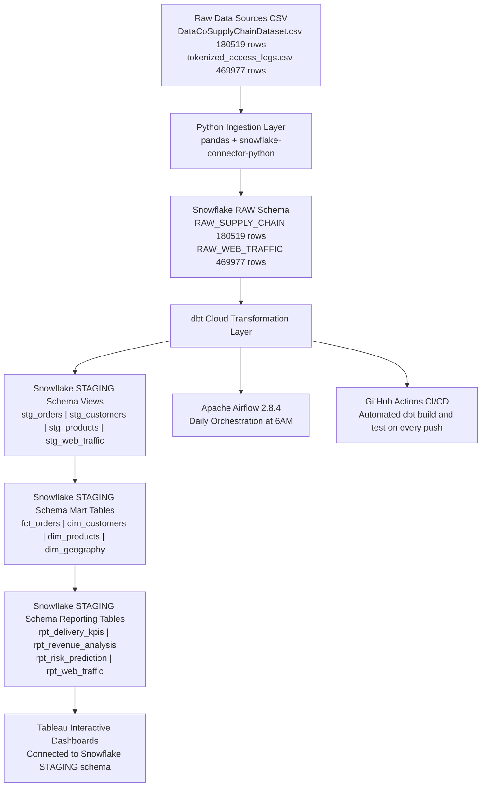

# Supply Chain Late Delivery Risk Intelligence Platform


## Overview

An enterprise-grade, end-to-end supply chain analytics platform built to identify orders at risk of late delivery before they occur. The platform ingests 180,519 order records and 469,977 web traffic events, transforms them through a fully tested multi-layer dbt pipeline on Snowflake, orchestrates daily execution via Apache Airflow, and delivers actionable risk intelligence through Tableau dashboards.

**Core Business Problem:** Supply chain teams lack early visibility into which orders will arrive late, resulting in reactive responses, customer dissatisfaction, and revenue loss.

**Solution:** A predictive analytics pipeline that surfaces late delivery risk signals across shipping modes, markets, regions, and customer segments, enabling proactive intervention before deliveries fail.

**Key Insight:** First Class shipping has a 95.6% late-delivery rate, more than double the 38.09% for Standard Class, representing a critical, actionable operational risk.

---

## Architecture



---

---

## Tech Stack

| Layer | Technology | Purpose |
|---|---|---|
| Ingestion | Python 3.12, pandas, snowflake-connector-python | Load raw CSV data to Snowflake |
| Data Warehouse | Snowflake (X-Small, AUTO_SUSPEND=60) | Single source of truth |
| Transformation | dbt Cloud | Multi-layer data modeling and testing |
| Orchestration | Apache Airflow 2.8.4 | Daily pipeline scheduling |
| CI/CD | GitHub Actions | Automated build and test on every push |
| Visualization | Tableau | Interactive risk intelligence dashboards |
| Version Control | Git + GitHub | Full version history and code management |

---

## Dataset

**Source:** DataCo Smart Supply Chain Dataset (Kaggle)

| File | Rows | Columns | Description |
|---|---|---|---|
| DataCoSupplyChainDataset.csv | 180,519 | 47 | Order-item level supply chain transactions |
| tokenized_access_logs.csv | 469,977 | 8 | Web clickstream and product browsing data |

**Date Range:** January 2015 — January 2018 (3 years)

**Prediction Target:** `LATE_DELIVERY_RISK` (binary — 1 = late, 0 = on time)
- Late deliveries: 98,977 (54.8%)
- On time: 81,542 (45.2%)

**PII Removed at Ingestion:** Customer Email, Customer Password, Customer Street, Product Description, Product Image, Order Zipcode

---

## dbt Data Models

### Staging Layer — Views

| Model | Rows | Description |
|---|---|---|
| stg_orders | 180,519 | Cleaned orders — cast dates from VARCHAR to TIMESTAMP, derived days_late and delivery_performance columns |
| stg_customers | 20,652 | Deduplicated customer records using SELECT DISTINCT on CUSTOMER_ID |
| stg_products | 118 | Deduplicated product catalog using SELECT DISTINCT on PRODUCT_CARD_ID |
| stg_web_traffic | 469,977 | Cleaned web clickstream with parsed timestamps and renamed columns |

### Marts Layer — Tables

| Model | Description |
|---|---|
| fct_orders | Core fact table at order-item grain — delivery performance flags, profitability flags, all financial metrics |
| dim_customers | Customer dimension — total orders, total sales, late delivery rate, customer value tier (High/Mid/Low) |
| dim_products | Product dimension — sales metrics, avg profit ratio, late delivery rate, price tier (Premium/Mid Range/Budget) |
| dim_geography | Geography dimension — late delivery rates across 23 global order regions and 5 markets |

### Reporting Layer — Tables

| Model | Description |
|---|---|
| rpt_delivery_kpis | Late delivery KPIs aggregated by order month, year, shipping mode, market, region, customer segment, department |
| rpt_revenue_analysis | Revenue, profit, discount analysis aggregated by market, segment, department, shipping mode, payment type |
| rpt_risk_prediction | Risk prediction features aggregated by shipping mode, market, region — ready for ML model inputs |
| rpt_web_traffic | Web traffic patterns aggregated by department, category, product, visit month, visit hour, time of day |

---

## Data Quality — 86 Automated Tests

| Layer | Tests | Test Types |
|---|---|---|
| Staging | 29 | unique, not_null, accepted_values |
| Marts | 34 | unique, not_null, accepted_values, relationships |
| Reporting | 21 | not_null, accepted_values |
| Custom SQL | 2 | Business logic validation |
| **Total** | **86** | **100% passing — 0 errors, 0 warnings** |

### Custom Business Logic Tests
- `assert_shipping_days_range` — Validates all shipping days fall between 0 and 6 (confirmed range from dataset)
- `assert_late_risk_matches_status` — Validates late_delivery_risk=1 always corresponds to delivery_status='Late delivery'

---

## Pipeline Orchestration — Apache Airflow

The full pipeline runs automatically every day at 6AM via Apache Airflow 2.8.4:

Task 1: load_raw_data_to_snowflake
Python script loads CSV data to Snowflake RAW schema
↓
Task 2: dbt_build
Runs all 12 dbt models across staging, marts, reporting
↓
Task 3: dbt_test
Runs all 86 data quality tests
↓
Task 4: verify_row_counts
Confirms RAW_SUPPLY_CHAIN = 180,519 rows
Confirms STG_ORDERS = 180,519 rows

**DAG ID:** `supply_chain_risk_pipeline`
**Schedule:** `0 6 * * *` (daily at 6AM)
**Executor:** SequentialExecutor
**Airflow UI:** `http://localhost:8080`

---

## CI/CD — GitHub Actions

Every push to `main` branch automatically triggers:

**DAG ID:** `supply_chain_risk_pipeline`
**Schedule:** `0 6 * * *` (daily at 6AM)
**Executor:** SequentialExecutor
**Airflow UI:** `http://localhost:8080`

---

## CI/CD — GitHub Actions

Every push to `main` branch automatically triggers:

Step 1: Checkout code
Step 2: Set up Python 3.12
Step 3: Install dbt-snowflake
Step 4: Create profiles.yml from GitHub Secrets
Step 5: dbt deps
Step 6: dbt build
Step 7: dbt test

Workflow file: `.github/workflows/dbt_ci.yml`

---

## Key Business Insights

| Metric | Finding |
|---|---|
| Highest risk shipping mode | First Class — 95.6% late delivery rate |
| Lowest risk shipping mode | Standard Class — 38.09% late delivery rate |
| Second Class late rate | 77.13% |
| Same Day late rate | 44.83% |
| Loss-making orders | 33,784 orders carry negative benefit per order |
| Global coverage | 23 order regions across 5 markets |
| Unique customers | 20,652 |
| Unique products | 118 across 50 categories |
| Data coverage | 3 years — January 2015 to January 2018 |

---

## Project Structure

```
supply-chain-risk-intelligence/
    .github/
        workflows/
            dbt_ci.yml
    airflow/
        dags/
            supply_chain_pipeline.py
    ingestion/
        load_to_snowflake.py
    models/
        staging/
            sources.yml
            staging_tests.yml
            stg_orders.sql
            stg_customers.sql
            stg_products.sql
            stg_web_traffic.sql
        marts/
            marts_tests.yml
            fct_orders.sql
            dim_customers.sql
            dim_products.sql
            dim_geography.sql
        reporting/
            reporting_tests.yml
            rpt_delivery_kpis.sql
            rpt_revenue_analysis.sql
            rpt_risk_prediction.sql
            rpt_web_traffic.sql
    tests/
        assert_shipping_days_range.sql
        assert_late_risk_matches_status.sql
    dbt_project.yml
```

---

## How to Run

### Prerequisites
```bash
# Python dependencies
pip install snowflake-connector-python==4.4.0 pandas==2.2.2

# Airflow environment
conda create -n airflow_env python=3.10 -y
conda activate airflow_env
pip install "apache-airflow==2.8.4" --constraint "https://raw.githubusercontent.com/apache/airflow/constraints-2.8.4/constraints-3.10.txt"
```

### 1. Run Python Ingestion
```bash
cd ingestion
python3 load_to_snowflake.py
```

### 2. Run dbt Pipeline
```bash
dbt build
dbt test
```

### 3. Start Airflow
```bash
conda activate airflow_env
export AIRFLOW_HOME=~/supply-chain-risk-intelligence/airflow
airflow webserver --port 8080
# In a second terminal tab:
airflow scheduler
# Open browser: http://localhost:8080
```

---


---

## Machine Learning Model

### Objective
Predict LATE_DELIVERY_RISK at the order level using pre-shipment features available at the time of order placement.

### Models Trained and Compared
| Model | Accuracy | Precision | Recall | F1 Score | AUC-ROC |
|---|---|---|---|---|---|
| XGBoost | 69.64% | 84.23% | 54.92% | 66.49% | 0.7305 |
| LightGBM | 69.65% | 84.67% | 54.52% | 66.33% | 0.7308 |

Winner: LightGBM selected based on the highest AUC-ROC score.

### Experiment Tracking
All experiments tracked in MLflow with full parameter logging and model artifacts.
Experiment name: supply_chain_late_delivery_prediction
MLflow UI: http://localhost:5000

### SHAP Feature Importance
SHAP analysis confirms SHIPPING_MODE is the dominant predictor of late delivery risk.
DAYS_FOR_SHIPMENT_SCHEDULED is the second most important feature.

### Key Finding
Shipping mode selection at order time is the single most controllable risk factor for predicting late delivery.

### ML Files
- ml/train_model.py — training script
- ml/outputs/best_model.pkl — saved LightGBM model
- ml/outputs/shap_summary.png — SHAP feature importance plot
- ml/outputs/predictions.csv — test set predictions

## Author

**Prajwal Gorkhar Chandrashekar**

Data Analyst with 2+ years of experience across machine learning, predictive analytics, computer vision, and business operations. Dual master's degree holder with hands-on expertise across the full modern data stack from raw ingestion to production-grade analytics pipelines.

- LinkedIn: [linkedin.com/in/prajwalshekar](https://linkedin.com/in/prajwalshekar)
- GitHub: [github.com/PrajwalShekar22](https://github.com/PrajwalShekar22)
- Portfolio: [datascienceportfol.io/pgorkhar](https://datascienceportfol.io/pgorkhar)

